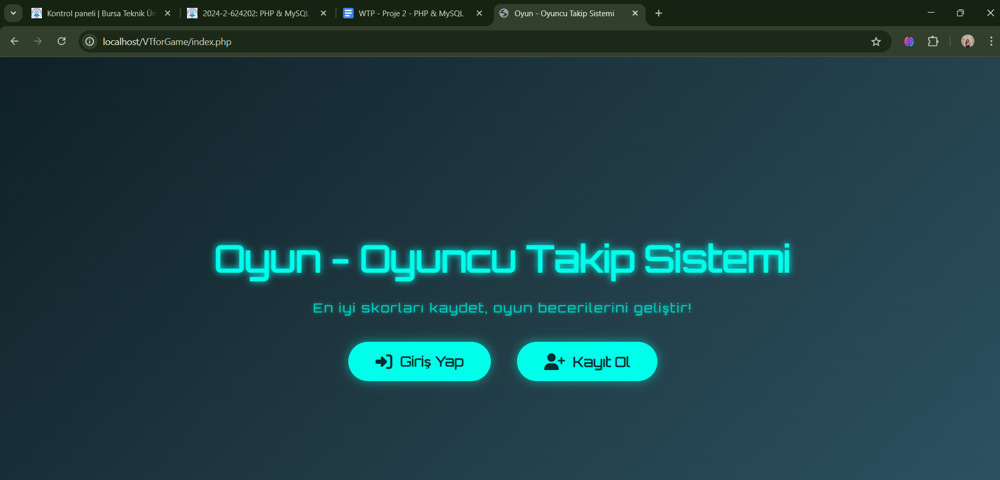

# 🎮 Game Management System

Proje videosu: https://www.youtube.com/watch?v=7AqlOC4fYDs

Modern ve güvenli oyun yönetim sistemi. Kullanıcılar hesap oluşturabilir, oyunlarını yönetebilir.




## 📋 Özellikler

- **👤 Kullanıcı Yönetimi**
  - Güvenli kayıt ve giriş sistemi
  - Profil düzenleme
  - Hesap silme
  

- **🎯 Oyun Yönetimi**
  - Oyun ekleme, düzenleme, silme
  - Oyun listesi görüntüleme
  - Kategori bazlı organize etme


## 🗂️ Dosya Yapısı

```
game-management-system/
├── config.php              # Veritabanı ve sistem konfigürasyonu
├── index.php              # Ana sayfa
├── register.php            # Kullanıcı kayıt sayfası
├── login.php              # Giriş sayfası
├── dashboard.php          # Kullanıcı kontrol paneli
├── logout.php             # Çıkış işlemi
├── delete_acc.php         # Hesap silme sayfası
├── add_game.php           # Oyun ekleme sayfası
├── edit_game.php          # Oyun düzenleme sayfası
├── delete_game.php        # Oyun silme işlemi
├── list_games.php         # Oyun listesi sayfası
├── database.sql           # Veritabanı yapısı
├── ai.md                  # AI sohbet kayıtları
└── README.md              # Bu dosya
```


## 📚 Kullanım

### 1. Hesap Oluşturma
- Ana sayfadan "Kayıt Ol" butonuna tıklayın
- Gerekli bilgileri doldurun

### 2. Giriş Yapma
- "Giriş Yap" sayfasından kullanıcı adı ve şifrenizi girin


### 3. Oyun Yönetimi
- Dashboard'dan "Oyun Ekle" seçeneğini kullanın
- Oyun bilgilerini girin (ad, kategori, açıklama, vb.)
- Oyunlarınızı listeleyin, düzenleyin veya silin


### Teknolojiler

- **Backend**: PHP 7.4+
- **Database**: MySQL 5.7+
- **Frontend**: HTML5, CSS3, JavaScript (ES6+)
- **Framework**: Bootstrap 5.3


*Bu README dosyası projenin gelişimi ile birlikte güncellenecektir.*
